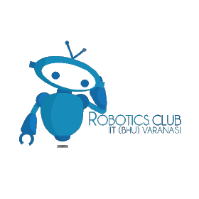
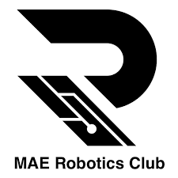
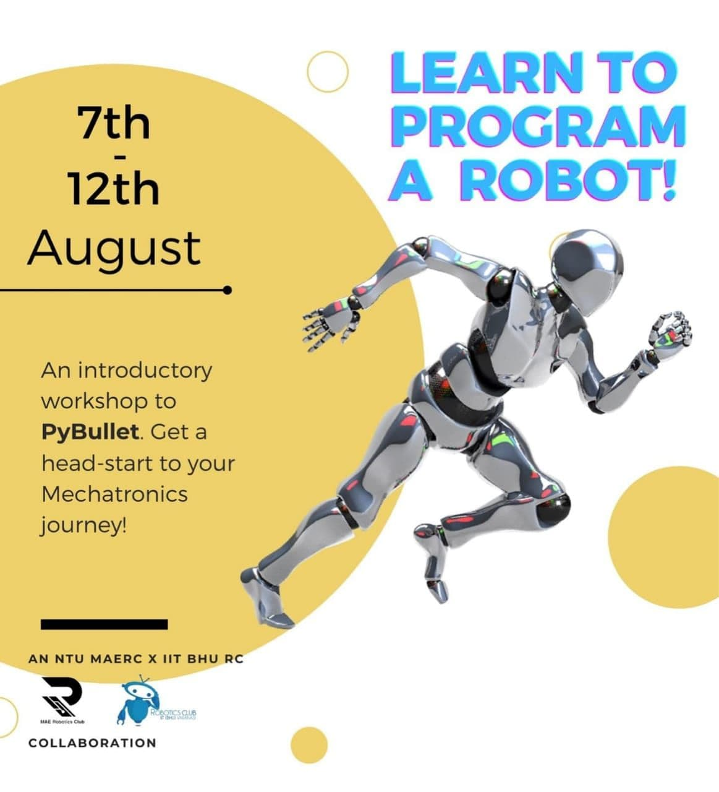

# Robotics-Club-x-NTU-MAERC-collab

 
 
 

 <i>presents:</i>  

 

***

# Welcome to the Pybullet Workshop
## Get ready to learn some control and shake some robots using your newly learnt pybullet skills

 
 
 

***
***

#### Excited to see the workshop structure??? Here it is - [Workshop Details](Webinar_Details--.pdf)
***
#### Here is the link to the presentation for logistics - [Logistics ppt](https://docs.google.com/presentation/d/1JEDMQ1MVdhzHvBFFwcCsBR0ii0pNqlAMPASn4Munbjo/edit?usp=sharing)

***
***

## We hope you will enjoy the workshop

 
 

 <i>All the best!!!</i>  

